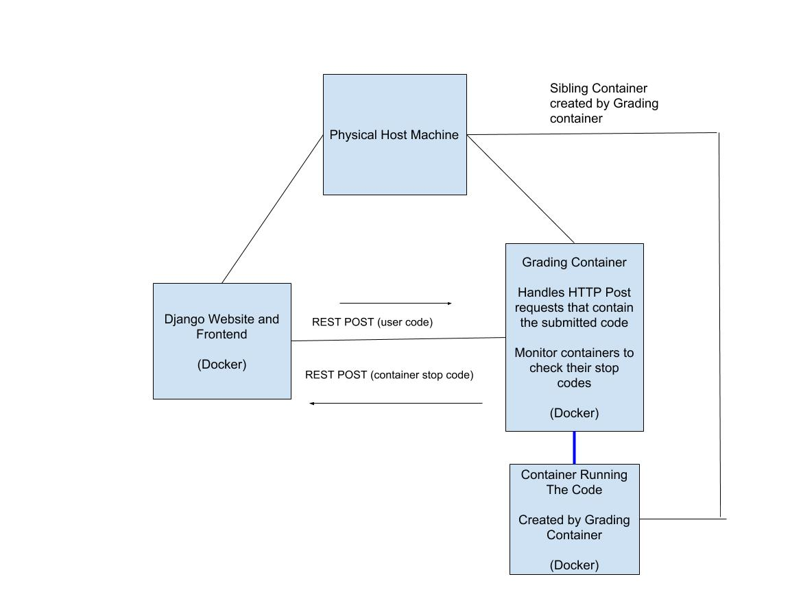

# ChicoACM-Competition
An all in one programming competition solution

# Website

## A user view

Should be a nice user interface where people competitng can easily create serious or throwaway accounts
Be able to view a list of problems for a given compeition
Click a specific problem and see the description, sample output and be able to subit their code for testing

BONUS: Add a real time chat system where contestant can ask judges question about problems

 ## An admin view
 Add problems to the compeititon. 
 Possibly design problem statements in .yml
 Define things like time restraints in this file
 When a user submits the problem this file will travel to the backend
 
 BONUS: Reply to real time chat from contestants or blast global messages
 
 # BackendTesterGraderThingy
 A docker container running a rest server waiting for requests from the website
 This container will spawn off sibling build containers that then compile and exectue the code given to them
 
 Sibling containers are good https://www.develves.net/blogs/asd/2016-05-27-alternative-to-docker-in-docker/ 
 Reduces the docker inception going on
 
 Use this sweet python docker libary on the backend to create new containers and monitor their exit codes
 https://docker-py.readthedocs.io/en/stable/

# General Project Diagram

